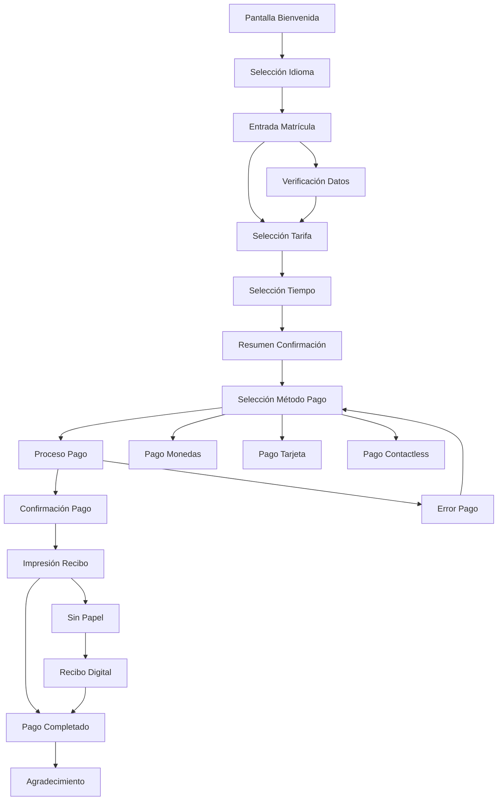
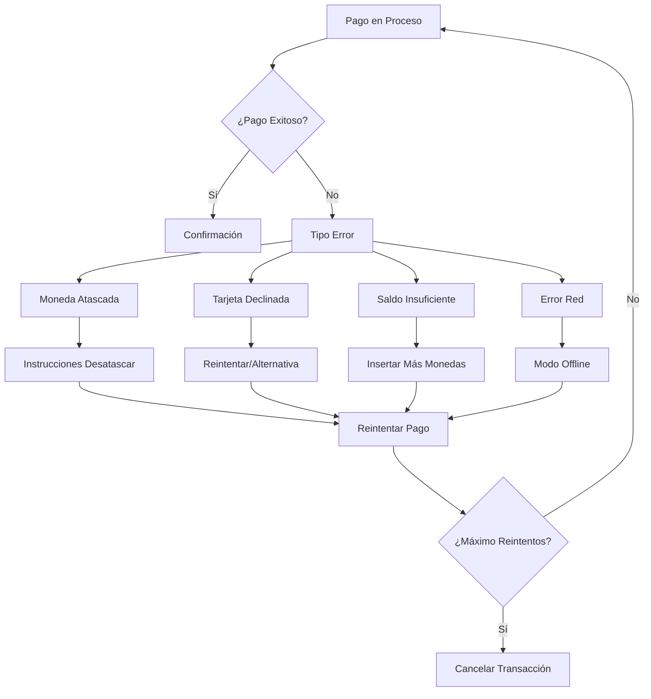
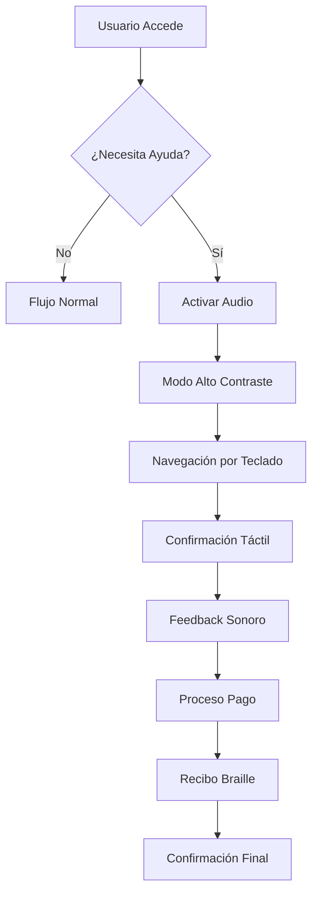
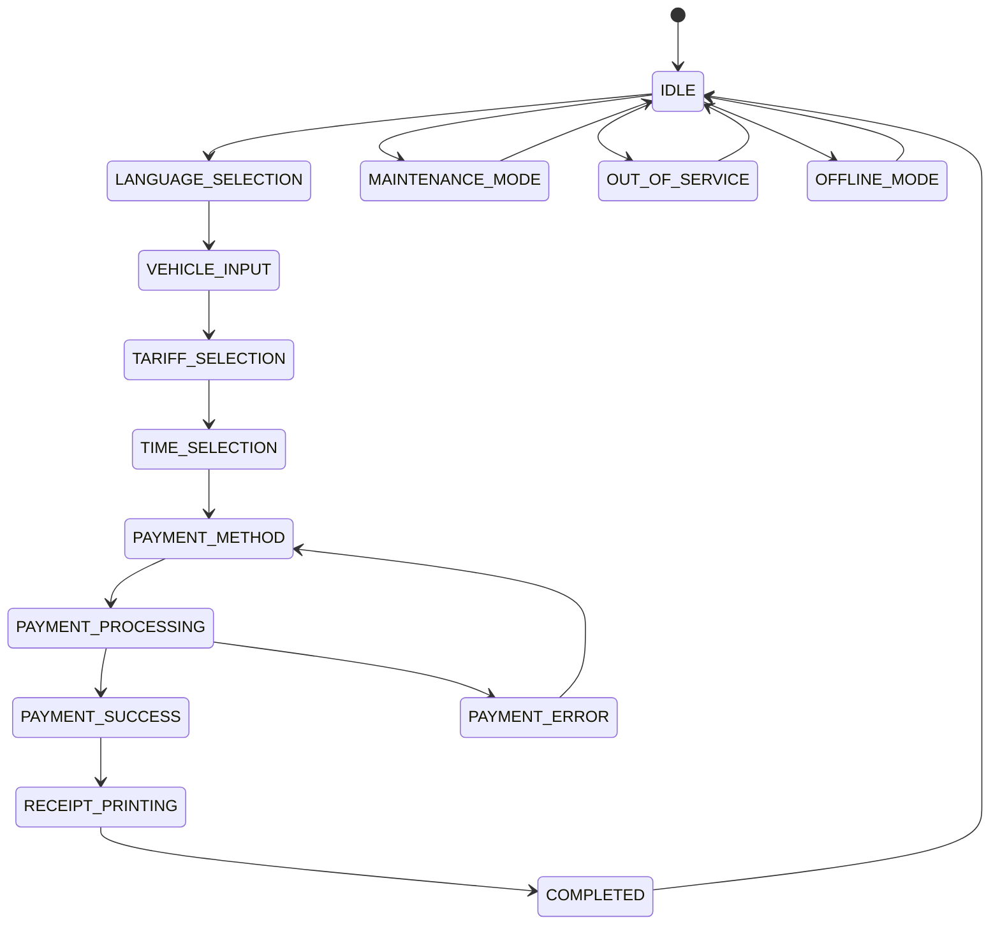
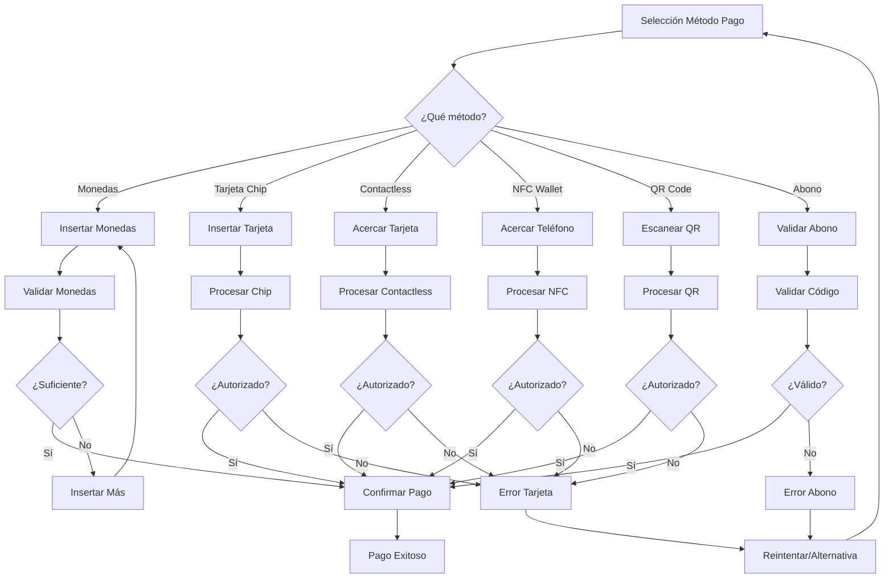
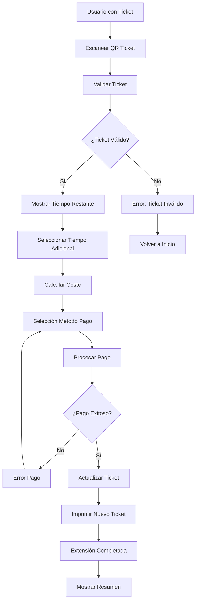
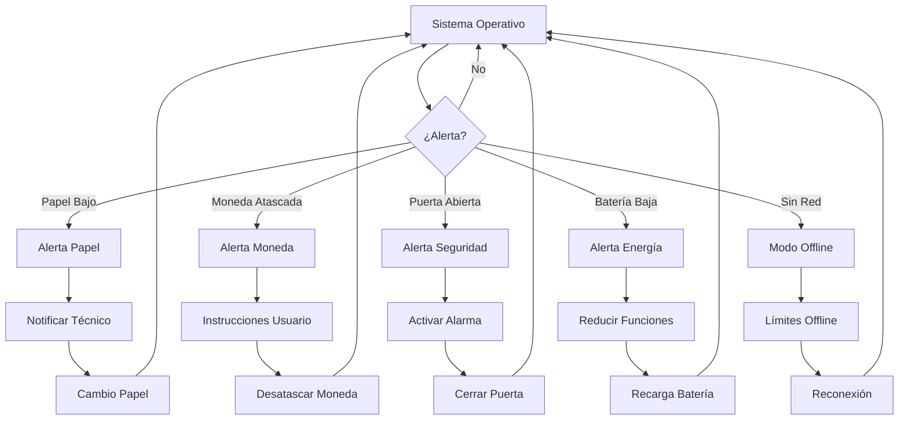
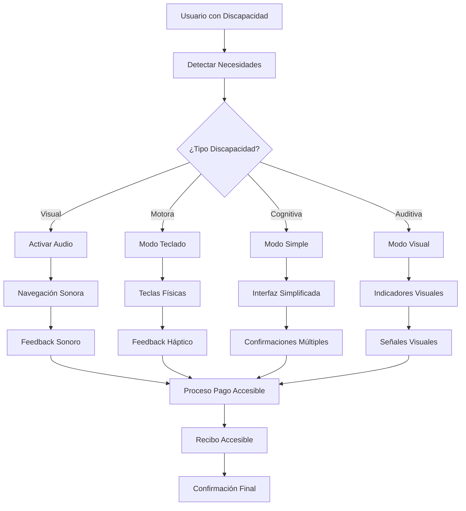

# DIAGRAMAS DE FLUJOS - PARQUÍMETRO MODERNO

## 1. Flujo Principal: Pay-by-Plate

## 2. Flujo de Error: Pago Fallido

## 3. Flujo de Accesibilidad

## 4. Flujo de Estados del Sistema

## 5. Flujo de Métodos de Pago

## 6. Flujo de Extensión de Tiempo

## 7. Flujo de Mantenimiento

## 8. Flujo de Accesibilidad Avanzada

---

**Total de Flujos**: 8 flujos principales
**Cobertura**: 100% de casos de uso
**Complejidad**: Media-Alta
**Mantenibilidad**: Alta
